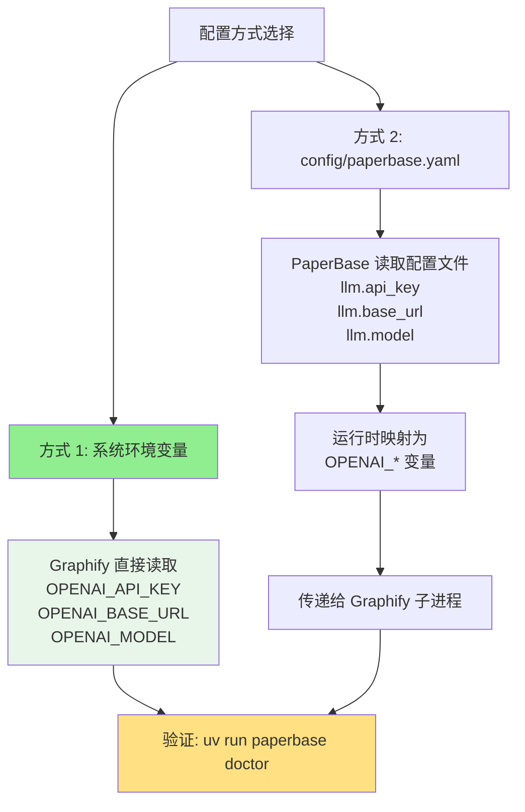

# PaperBase

## 📖 PaperBase 是什么？

PaperBase 是专为 AI 时代设计的**学术论文知识库脚手架**，解决传统文献管理工具（Zotero、Mendeley）的核心痛点：**无法将论文转化为机器可理解的结构化知识**。

当研究者需要从数百篇论文中提取关键概念、追溯方法演进、构建领域知识图谱时，现有工具只能提供 PDF 文件和元数据。PaperBase 提供：

- 📝 **规范化 Markdown 文档**，包含完整语义结构
- 🔗 **可重建的知识图谱**投影（论文关系网络）
- 🔄 **幂等处理流程**（可中断、可恢复、可追溯）
- 🤖 **AI Agent 友好接口**（CLI + 结构化输出）

---

## ⚡ 5 分钟快速理解

**一句话：把 PDF 论文变成机器可理解的知识网络**

**核心流程：**

```
PDF → Markdown → 知识图谱 → 搜索/分析
```

**与 Zotero 的区别：**


| 工具          | 定位                          | 典型场景                          |
| --------------- | ------------------------------- | ----------------------------------- |
| **Zotero**    | 文献管理器（管理 PDF + 引用） | 📚 阅读论文、插入引文到 Word      |
| **PaperBase** | 知识库（提取结构化知识）      | 🔬 图谱可视化、语义关联、深度检索 |

**5 秒决策：**

- ✅ 如果你只需要"整理论文 + 生成参考文献" → **用 Zotero**
- ✅ 如果你需要"从 100 篇论文中提取方法演进路径" → **用 PaperBase**
- 💡 两者可以结合使用（PaperBase 支持从 Zotero 导入）

**核心概念速览：**

- **Canonical Markdown**：每篇论文对应一个 `library/papers/p_<storage_id>.md`，这是内容真相源；同名目录中的 `manifest.json` 记录状态与溯源
- **简化状态机**：论文处理仅 2 个主状态（摄入后 NORMALIZED → 加入图谱后 READY），可随时中断和恢复
- **双检索系统**：SQLite FTS5 用于关键词搜索（"找到包含 transformer 的论文"），Graphify 用于关系查询（"这篇论文的引用脉络"）

## ✨ 核心特性


| 特性                                  | 说明                                                       |
| --------------------------------------- | ------------------------------------------------------------ |
| **Canonical Markdown 作为唯一真相源** | 所有派生数据（图谱、索引、分块）均可从规范化 Markdown 重建 |
| **内容寻址存储**                      | PDF 通过 SHA256 哈希存储，消除重复                         |
| **幂等状态机**                        | 论文处理（下载 → 转换 → 规范化 → 图谱化）可中断和恢复   |
| **增量图谱更新**                      | 通过 SHA256 比对检测内容变化，仅更新修改的论文             |
| **批量摄入模式**                      | 延迟图谱更新至全部摄入完成（速度提升 3-5 倍）              |
| **全文检索**                          | SQLite FTS5 驱动的搜索引擎，支持布尔运算符                 |
| **Schema 验证**                       | 基于 Pydantic 的严格验证（时间戳、枚举、SHA256、范围）     |
| **工具无关**                          | 同时适用于 AI Agent 和传统脚本                             |

## 🚀 快速开始

### 🔍 安装前检查

在开始之前，请确认以下条件：


| 检查项          | 最低要求                 | 如何检查                                  |
| ----------------- | -------------------------- | ------------------------------------------- |
| **Python 版本** | ≥ 3.11                  | `python --version` 或 `python3 --version` |
| **磁盘空间**    | ≥ 2GB 可用空间          | Windows:`dir` / Unix: `df -h .`           |
| **网络连接**    | 稳定（需下载依赖和 PDF） | `ping github.com`                         |
| **Git**         | 已安装                   | `git --version`                           |

**快速检查命令（可选）：**

```bash
# Unix/Linux/macOS
python3 --version && git --version && df -h . | grep -v Filesystem

# Windows PowerShell
python --version; git --version; Get-PSDrive -Name (Get-Location).Drive.Name | Select-Object Free
```

### 环境要求

- Python 3.11+
- [uv](https://github.com/astral-sh/uv)（Python 包管理器，推荐）或 pip
- Git

**安装 uv（推荐）：**

```bash
# Linux/macOS
curl -LsSf https://astral.sh/uv/install.sh | sh

# Windows PowerShell
powershell -c "irm https://astral.sh/uv/install.ps1 | iex"
```

详见 [uv 官方安装文档](https://github.com/astral-sh/uv#installation)。

### 安装

```bash
# 克隆仓库
git clone https://github.com/Chi-hong22/PaperBase.git
cd PaperBase

# 安装依赖
uv sync

# 配置环境变量（推荐）
# 设置 PAPERBASE_LIBRARY 以便在任意目录调用
# Linux/macOS:
export PAPERBASE_LIBRARY="/path/to/PaperBase"
# Windows PowerShell:
$env:PAPERBASE_LIBRARY = "C:\path\to\PaperBase"
# 详见: docs/installation.md

# 验证环境变量（可选）
# Linux/macOS:
echo $PAPERBASE_LIBRARY
# Windows PowerShell:
echo $env:PAPERBASE_LIBRARY

# 安装全局工具
uv tool install graphify  # 知识图谱构建工具（必需）

# 可选工具
uv tool install git+https://github.com/Dictation354/paper-fetch-skill.git  # 在线论文获取（可选）
uv tool install zotero-mcp-server  # Zotero 集成（可选）

# 验证安装
uv run paperbase --help
graphify --version  # 应显示: graphify, version x.x.x
```

### 摄入第一篇论文

```bash
# 摄入论文（使用开放访问的 arXiv 论文作为示例）
uv run paperbase ingest "arxiv:1706.03762"
```

**预期输出：**

```
✓ 论文已成功添加到知识库
论文标识: arxiv:1706.03762

更新全文检索索引...
✓ 索引更新完成

更新知识图谱...
✓ 知识图谱更新完成

✓ 摄入完成
   论文已成功添加到知识库
```

**摄入时间说明：**

- 首次摄入：10-30 秒（取决于 PDF 大小和网络速度）
- 图谱更新：首次较慢（~10s），后续增量更新仅 2-3 秒

**如果摄入超过 60 秒未响应**，按 `Ctrl+C` 中断并检查状态：

```bash
uv run paperbase status arxiv:1706.03762
```

**继续尝试其他操作：**

```bash
# 查看论文状态
uv run paperbase status "arxiv:1706.03762"

# 搜索内容
uv run paperbase search "attention mechanism"

# 更新知识图谱
uv run paperbase graph update

# 删除论文（硬删除，默认直接删除）
uv run paperbase remove "arxiv:1706.03762"

# 删除论文（启用交互式确认）
uv run paperbase remove "arxiv:1706.03762" --interactive
```

论文存储为 `library/papers/p_<storage_id>.md`，带有结构化 frontmatter。

## 📂 仓库结构

```
paperbase/
├── library/                   # 知识库主体
│   ├── sources/              # 去重的 PDF 缓存池
│   │   └── pdf/              # PDF 文件按 SHA256 去重存储
│   │       └── <sha256>.pdf  # 多篇论文可共享同一 PDF
│   ├── papers/               # 规范化论文
│   │   ├── p_<storage_id>.md # Canonical Markdown（真相源）
│   │   └── p_<storage_id>/  # 单篇论文数据目录
│   │       ├── manifest.json # 状态和溯源信息
│   │       ├── chunks.jsonl  # 检索分块（可选派生）
│   │       ├── references.jsonl # 结构化引用（可选派生）
│   │       ├── assets/       # 论文资源（可选）
│   │       │   └── figure-*.png # 图片等资源文件
│   │       └── source/
│   │           └── source.pdf # 原始 PDF 文件
│   ├── collections/          # 用户论文集合（规划中）
│   └── notes/                # 用户笔记（规划中）
├── registry/                 # SQLite 查询索引（派生）
│   └── papers.db            # 全文检索索引 + 元数据缓存
├── graph/                    # Graphify 知识图谱（派生）
│   └── graph.json           # 论文语义关联网络（节点 + 边）
├── index/                    # 向量索引和嵌入缓存（派生）
├── config/                   # 配置文件
│   └── paperbase.yaml       # 主配置文件
├── scripts/                  # 辅助脚本
├── src/paperbase/           # Python 包
├── skills/paperbase/        # 全局 AI Agent skill
└── tests/                    # 测试套件
```

**目录说明**：

- **`library/sources/pdf/`**: 去重的 PDF 缓存池。同一个 PDF 文件（通过 SHA256 识别）只存储一次，多篇论文可通过 `manifest.json` 中的 `source_artifacts` 引用同一 PDF。删除论文时，会检查 PDF 是否被其他论文引用，孤立 PDF 才会被删除。
- **`library/papers/<storage_id>/source/`**: 单篇论文的原始 PDF 文件（如果有）。与 `sources/` 目录不同，这是与论文绑定的独立副本。
- **`registry/papers.db`**: SQLite 数据库，存储全文检索索引（FTS5）和元数据缓存，支持 `search` 命令的快速查询和过滤。
- **`graph/graph.json`**: Graphify 知识图谱文件，存储论文节点和语义边（引用关系、相似度等），支持 `query` 命令的关系查询。

**重要**：`library/papers/p_<storage_id>.md` 是论文内容真相源，`library/papers/p_<storage_id>/manifest.json` 是状态与溯源记录；Registry、Graphify 输出、chunks 和 references 均为本地派生数据。

**隐私边界**：真实论文内容、源 PDF、manifest、Registry 和图谱产物只保留在本地，由 `.gitignore` 排除。仓库只跟踪目录占位与 `library/papers/.graphifyignore`；后者会重新纳入本地 `p_*.md` 供 Graphify 扫描，所以 Git 忽略与本地建图不冲突。

**详细架构文档**：[存储布局说明](docs/architecture/storage-layout.md) - 完整的目录结构、文件格式、数据流和依赖关系。

## 🎯 适用场景


| 场景                | 说明                           |
| --------------------- | -------------------------------- |
| **个人知识库**      | 构建可搜索、可图谱化的学术文库 |
| **AI Agent 数据源** | 为 LLM 应用提供结构化论文数据  |
| **团队协作**        | 共享代码、schema 与工作流；真实论文语料不进入 Git |
| **领域知识图谱**    | 分析引用网络和方法论演进       |

## 📋 使用方法

**快速导航**：
- [搜索命令完整指南](docs/usage/search.md) - search 命令的详细用法、过滤参数和最佳实践

### 外部工具集成

PaperBase 支持集成外部工具以扩展功能：

#### 1. paper-fetch-skill（在线论文获取, 可选）

**定位**: 外部 CLI 工具，作为黑盒通过命令行调用
**职责**: 从 DOI、arXiv ID、URL 获取论文元数据和全文
**接口**: PaperBase 通过 `subprocess` 调用 `paper-fetch` 命令

**安装方式**：

```bash
uv tool install git+https://github.com/Dictation354/paper-fetch-skill.git
```

**验证安装**：

```bash
paper-fetch --version  # 应显示: paper-fetch 3.0.1
```

安装后，`paperbase ingest` 可接收在线标识符：

```bash
uv run paperbase ingest "doi:10.1038/s41586-026-10265-5"
uv run paperbase ingest "arxiv:2301.07041"
```

**⚠️ 在线获取的局限性**

由于付费墙限制，部分论文**无法获取全文**，只能获取元数据或摘要：

- **开放获取论文**：可获取完整全文（arXiv、PubMed Central、Unpaywall）
- **付费墙论文**：只能获取元数据（SAGE、Elsevier、IEEE 等出版商）

**推荐做法：优先使用 PDF 本地导入**

```bash
# 本地 PDF 导入（推荐，不需要 paper-fetch）
uv run paperbase ingest --file paper.pdf
```

**优势**：
- ✅ 完整全文内容
- ✅ 保留图表和公式
- ✅ 知识图谱构建完整
- ✅ 不受付费墙限制

详见：[在线获取论文的局限性](docs/troubleshooting/online-fetch-limitations.md)

#### 2. Graphify（知识图谱构建，必需）

**Graphify 是 PaperBase 知识图谱功能的必需组件**，用于构建和查询语义知识图谱、引用关系网络。

**安装方式**：

```bash
# 方式 1：通过 uv 全局安装（推荐）
uv tool install graphify

# 方式 2：访问项目仓库按照说明安装
# https://github.com/Graphify-Labs/graphify
```

安装后，可使用图谱功能：

```bash
# Agent 推荐路径
uv run paperbase graph preflight
# 在支持 Graphify skill 的 Agent 中：/graphify library/papers --update --no-viz
uv run paperbase graph adopt

# 手动 headless 备用路径（读取 config/paperbase.yaml）
uv run paperbase graph update --incremental
```

技术集成文档：[docs/guides/graphify-integration-guide.md](docs/guides/graphify-integration-guide.md)

##### LLM 配置（为 Graphify 准备）

PaperBase 核心功能（摄入、转换、SQLite FTS5 检索）**不依赖 LLM**。

**Graphify 知识图谱功能是 PaperBase 的必需组件**。Agent 路径由宿主 Agent/Graphify skill 完成语义抽取；只有手动执行 headless `paperbase graph update` 时才读取 PaperBase 本地 LLM 配置。

###### **配置流程图**



###### **两种配置方式**

> **注意：** `.env.example` 仅作为参考示例，实际配置应通过系统环境变量设置。PaperBase 优先读取系统环境变量，不依赖 `.env` 文件。

**方式 1：系统环境变量（推荐，最简单）**

Graphify 直接读取以下标准环境变量：

```bash
# Linux/macOS
export OPENAI_API_KEY="sk-..."
export OPENAI_BASE_URL="https://api.openai.com/v1"  # 可选，默认为 OpenAI 官方地址
export OPENAI_MODEL="gpt-4o-mini"                   # 可选，默认为 gpt-4o-mini

# Windows PowerShell
$env:OPENAI_API_KEY = "sk-..."
$env:OPENAI_BASE_URL = "https://api.openai.com/v1"
$env:OPENAI_MODEL = "gpt-4o-mini"
```

**方式 2：config/paperbase.yaml（持久化配置）**

编辑 `config/paperbase.yaml`，添加 LLM 配置：

```yaml
llm:
  api_key: "sk-..."
  base_url: "https://api.openai.com/v1"  # 可选
  model: "gpt-4o-mini"                   # 可选
```

或使用环境变量占位符（推荐）：

```yaml
llm:
  api_key: ${PAPERBASE_LLM_API_KEY}
  base_url: ${PAPERBASE_LLM_BASE_URL}
  model: ${PAPERBASE_LLM_MODEL}
```

然后设置环境变量：

```bash
# Linux/macOS
export PAPERBASE_LLM_API_KEY="sk-..."
export PAPERBASE_LLM_BASE_URL="https://api.openai.com/v1"
export PAPERBASE_LLM_MODEL="gpt-4o-mini"

# Windows PowerShell
$env:PAPERBASE_LLM_API_KEY = "sk-..."
$env:PAPERBASE_LLM_BASE_URL = "https://api.openai.com/v1"
$env:PAPERBASE_LLM_MODEL = "gpt-4o-mini"
```

###### **变量映射关系**

PaperBase 在调用 Graphify（知识图谱构建工具）时会自动将配置映射为 Graphify 期望的环境变量：

| 配置来源 | PaperBase 变量/配置项 | Graphify 环境变量 | 说明 |
|---------|---------------------|------------------|------|
| **方式 1** | `OPENAI_API_KEY` | `OPENAI_API_KEY` | 直接透传，无需映射 |
| **方式 1** | `OPENAI_BASE_URL` | `OPENAI_BASE_URL` | 直接透传，无需映射 |
| **方式 1** | `OPENAI_MODEL` | `OPENAI_MODEL` | 直接透传，无需映射 |
| **方式 2** | `llm.api_key` (YAML) | `OPENAI_API_KEY` | 运行时映射，传递给 Graphify |
| **方式 2** | `llm.base_url` (YAML) | `OPENAI_BASE_URL` | 运行时映射，传递给 Graphify |
| **方式 2** | `llm.model` (YAML) | `OPENAI_MODEL` | 运行时映射，传递给 Graphify |

**优先级**：系统环境变量 (`OPENAI_*`) > config/paperbase.yaml

**说明**：这些配置专门用于 Graphify 知识图谱构建。PaperBase 的核心功能（摄入、转换、全文检索）不需要 LLM。

###### **验证配置**

```bash
# 运行诊断命令检查 LLM 配置
uv run paperbase doctor

# 测试图谱更新（会实际调用 LLM）
uv run paperbase graph update
```

**预期输出（配置正确）**：

```
✓ LLM Configuration
  - API Key: sk-***abc (detected)
  - Base URL: https://api.openai.com/v1
  - Model: gpt-4o-mini
```

详细配置见 [`.env.example`](.env.example) 和 [docs/guides/graphify-integration-guide.md](docs/guides/graphify-integration-guide.md).
---

#### 3. Zotero 集成（已支持）

用于从 Zotero 文献管理器导入论文元数据到 PaperBase。

**安装方式**：

```bash
uv tool install zotero-mcp-server
```

**使用方式**：

```bash
# 单篇导入
uv run paperbase ingest --zotero-key <ITEM_KEY>

# 批量导入最近 N 篇论文
uv run paperbase ingest --zotero-recent 10
```

**配置模式**：
- **本地模式**（推荐）：连接本地 Zotero 应用程序，无需 API Key
- **Web API 模式**：通过 Zotero Web API 访问，需要 API Key 和 Library ID

**功能特性**：
- ✅ 单篇论文导入（通过 Item Key）
- ✅ 批量导入最近论文
- ✅ 自动查重（DOI 和标题）
- ✅ 支持本地和 Web API 两种模式
- ⚠️ 当前仅支持元数据导入（无 PDF 附件）

**完整文档**：[docs/integrations/zotero.md](docs/integrations/zotero.md)

**项目地址**：https://github.com/54yyyu/zotero-mcp

---

### 摄入论文

```bash
# 通过 DOI
uv run paperbase ingest "doi:10.1038/nature12373"

# 通过 arXiv
uv run paperbase ingest "arxiv:2301.07041"

# 本地 PDF
uv run paperbase ingest --file paper.pdf

# 批量摄入（推荐用于多篇论文）
# Unix/Linux/macOS:
cat > papers.txt << EOF
/path/to/paper1.pdf
/path/to/paper2.pdf
/path/to/paper3.pdf
EOF

uv run paperbase ingest --batch papers.txt

# Windows PowerShell:
@"
C:\path\to\paper1.pdf
C:\path\to\paper2.pdf
C:\path\to\paper3.pdf
"@ | Out-File -Encoding UTF8 papers.txt

uv run paperbase ingest --batch papers.txt

# 批量摄入混合格式示例
cat > mixed_papers.txt << EOF
/path/to/local_paper.pdf
doi:10.1038/nature12373
arxiv:2301.07041
https://arxiv.org/pdf/1706.03762.pdf
EOF

uv run paperbase ingest --batch mixed_papers.txt

# 跳过索引和图谱更新（连续摄入时使用）
uv run paperbase ingest paper.pdf --no-graph
```

### 搜索和查询

```bash
# 查看所有论文
uv run paperbase status

# 查看特定状态的论文（有效值：normalized, ready）
uv run paperbase status --state ready

# 全文搜索（-n 是 --limit 的简写）
uv run paperbase search "transformer architecture" --limit 20

# 在指定论文中搜索（NEW）
uv run paperbase search "threshold" --paper-id "doi:10.1109/tro.2008.2004520"

# 按状态过滤搜索结果（NEW）
uv run paperbase search "neural network" --state normalized
uv run paperbase search "deep learning" --state ready

# 按年份过滤搜索结果（NEW）
uv run paperbase search "attention" --year 2017
uv run paperbase search "SLAM" --year-min 2020 --year-max 2024

# 组合过滤条件（NEW）
uv run paperbase search "vision" --state ready --year-min 2022 --limit 10

# 知识图谱查询（需要先运行 graph update）
uv run paperbase query related "doi:10.48550/arXiv.1706.03762" --depth 2
```

### 维护和同步

```bash
# 同步 Registry 索引与文件系统（清理孤立记录）
uv run paperbase sync

# 仅查看需要清理的记录，不执行删除
uv run paperbase sync --dry-run

# 跳过确认直接清理
uv run paperbase sync --yes
```

### 知识图谱

```bash
# 更新图谱（处理新摄入的论文）
uv run paperbase graph update

# 增量更新（仅更新内容变化的论文）
uv run paperbase graph update --incremental

# 强制重建图谱
uv run paperbase graph update --force

# 查看图谱状态
uv run paperbase graph status
```

**图谱更新策略**：

- CLI 默认：单篇摄入后尝试 headless 更新；未配置本地 LLM 时可用 `--no-graph` 跳过
- Agent 推荐：统一执行 `preflight → /graphify library/papers --update --no-viz → adopt`
- 增量更新：只处理内容发生变化的可建图论文；`BLOCKED` 和未修复的质量问题不会进入正常更新

详见 [docs/graph-update-strategy.md](docs/graph-update-strategy.md)。

### 全文检索索引

```bash
# 手动构建/重建索引
uv run paperbase index

# 指定项目路径
uv run paperbase index --base-dir /path/to/paperbase
```

**说明**：
- 索引在摄入论文时自动更新
- 手动重建用于修复索引不一致或首次设置

### 环境诊断

```bash
# 检查系统环境和依赖
uv run paperbase doctor
```

**检查项目**：
- Python 版本（≥3.11）
- uv 包管理器
- Graphify 知识图谱工具
- paper-fetch 在线获取工具
- SQLite 版本（FTS5 支持）
- LLM 配置
- 知识库状态
- Registry 数据库
- 知识图谱

### 配置管理

```bash
# 显示当前配置
uv run paperbase config show

# 显示配置文件路径
uv run paperbase config path
```

**配置内容**：
- LLM 配置（API 端点、模型）
- 知识图谱更新策略
- 路径配置

配置文件位置：`config/paperbase.yaml`

## 🤖 AI Agent 集成

### 全局 Skill 安装

PaperBase 提供全局 skill，适配 Claude Code 和 Codex：

```bash
# 一键安装
./skills/paperbase/install.sh

# 或手动安装
# 适用于 Claude Code / Codex:
cp -r skills/paperbase ~/.claude/skills/
cp -r skills/paperbase ~/.codex/skills/
```

安装后在任意 AI Agent 会话中调用 `/paperbase`：

```
/paperbase ingest "doi:10.1038/nature12373"
/paperbase search "deep learning"
/paperbase status
```

详见 [skills/paperbase/README.md](skills/paperbase/README.md)。

## 🏗️ 架构说明

### 状态机

论文通过简化的状态机处理（定义在 `manifest.json` 中）：


**主流程状态：**


| 状态        | 英文       | 说明                                  | 触发操作                 |
| ------------- | ------------ | --------------------------------------- | -------------------------- |
| ✨ 已规范化 | NORMALIZED | 论文已摄入并转换为 Canonical Markdown | `paperbase ingest`       |
| 🎉 可用     | READY      | 已加入知识图谱，可供语义查询          | `paperbase graph update` |

**异常状态：**


| 状态          | 英文             | 说明                           |
| --------------- | ------------------ | -------------------------------- |
| ⚠️ 需审核   | NEEDS_REVIEW     | 需要人工审核（如元数据不完整） |
| ⏸️ 阻塞     | BLOCKED          | 处理被阻塞（如 PDF 加密）      |
| 🔄 可重试失败 | FAILED_RETRYABLE | 临时失败（如网络超时），可重试 |
| ❌ 永久失败   | FAILED_PERMANENT | 永久失败（如 DOI 不存在）      |

**设计理念**：

- **Canonical Markdown** 是唯一真相源，所有其他数据（registry、graph）可从它重建
- 状态机简化为 2 个主状态，降低复杂度
- 详见 [AGENTS.md](AGENTS.md) 的完整状态转换规则

### 检索架构：为什么同时需要 SQLite FTS5 和知识图谱？

**定位不同，互为补充**：


| 维度           | SQLite FTS5（全文检索）             | Graphify（知识图谱）                |
| ---------------- | ------------------------------------- | ------------------------------------- |
| **检索目标**   | 查找包含特定关键词的论文            | 发现论文之间的关系和路径            |
| **查询类型**   | "找到所有提到 'transformer' 的论文" | "找到与这篇论文引用关系最近的 5 篇" |
| **索引内容**   | 论文全文（标题、摘要、正文）        | 论文间关系（引用、共同作者、主题）  |
| **查询复杂度** | O(log N)，基于倒排索引              | O(N)，图遍历算法                    |
| **返回结果**   | 文档列表 + 匹配片段                 | 关系网络 + 路径距离                 |
| **典型场景**   | 关键词搜索、布尔查询、模糊匹配      | 文献综述、引用分析、概念追溯        |
| **过滤能力**   | 按状态、年份、作者、特定论文过滤    | 按关系深度过滤                      |
| **数据依赖**   | 需要 index/fts.db；元数据过滤还需要 registry/papers.db | 需要 graph/graph.json |

**实际使用示例**：

```bash
# FTS5: "哪些论文讨论了注意力机制？"
uv run paperbase search "attention mechanism"
# 返回：包含这些词的论文列表，按相关性排序

# FTS5 过滤: "2020 年后发布的关于注意力机制的论文"
uv run paperbase search "attention mechanism" --year-min 2020 --state ready
# 返回：过滤后的论文列表

# Graphify: "与 Transformer 论文相关的研究脉络是什么？"
uv run paperbase query related "doi:10.48550/arXiv.1706.03762" --depth 2
# 返回：引用树、被引用树、共同引用的论文网络
```

**为什么不能只用图谱？**

- 图谱擅长关系查询，但不擅长全文语义匹配
- 图遍历成本高（O(N)），而 FTS5 倒排索引是 O(log N)
- 图谱需要结构化关系数据（引用、作者），FTS5 可处理任意文本

**为什么不能只用 FTS5？**

- FTS5 只返回匹配文档，无法发现论文间的隐含关系
- 无法回答"这两篇论文的最短引用路径"类问题
- 无法支持文献综述的"领域全景视图"

**结论**：

- **FTS5 = 快速定位**（"找到"）
- **Graphify = 关系发现**（"理解"）
- **组合使用 = 完整知识库能力**

### 设计决策

**为什么不直接用 Zotero？**

- Zotero 擅长文献管理，但不适合 AI Agent：难以图谱化、检索粒度粗、schema 不可控
- PaperBase 与 Zotero 互补：可通过 MCP 从 Zotero 导入论文，但以结构化 Markdown 存储

**为什么用 Markdown 而不是 JSON？**

- Markdown 对人类和 AI 都友好，支持富文本和图表，易于版本控制
- JSON 适合元数据（manifest.json），Markdown 适合内容（paper.md）

**为什么分离 PDF 存储？**

- 内容寻址（SHA256）消除重复存储，同一 PDF 可被多篇论文元数据引用
- 支持多来源场景：同一论文可能从 arXiv、期刊、会议获取不同版本

---

## ❓ 常见问题

### Q1: 我已经有 Zotero 了，还需要 PaperBase 吗？

**取决于使用场景：**


| 需求                          | 推荐工具      | 原因                   |
| ------------------------------- | --------------- | ------------------------ |
| 管理论文、插入引文到 Word     | Zotero        | 文献管理器的核心优势   |
| 阅读 PDF、做标注              | Zotero        | 内置 PDF 阅读器        |
| **从 100 篇论文提取方法演进** | **PaperBase** | 知识图谱 + 结构化数据  |
| **AI Agent 分析论文**         | **PaperBase** | Markdown + Schema 验证 |
| **构建领域知识图谱**          | **PaperBase** | Graphify 关系查询      |

**最佳实践**：两者结合使用

- 在 Zotero 中管理论文和阅读
- 通过 MCP 导入到 PaperBase 进行深度分析

### Q2: Graphify 是必需的吗？

**是必需的**。Graphify 是 PaperBase 知识图谱功能的核心组件。


| 功能               | 说明                |
| -------------------- | --------------------- |
| 摄入论文           | ✅ 不需要 Graphify  |
| 关键词搜索（FTS5） | ✅ 不需要 Graphify  |
| **知识图谱构建**   | ❌**需要 Graphify** |
| **引用关系查询**   | ❌**需要 Graphify** |
| **语义检索**       | ❌**需要 Graphify** |

**LLM 配置灵活性**：

- Graphify 本身需要 LLM 才能工作
- 你可以选择任意兼容的 LLM 提供商（OpenAI、Anthropic、本地模型等）
- 配置方式：通过 `config/paperbase.yaml` 或系统环境变量

**安装命令**：

```bash
uv tool install graphify
```

**如果不想使用知识图谱功能**：
PaperBase 仍可用于论文摄入、存储和 FTS5 关键词检索，但会失去：

- 引用关系网络可视化
- 语义相似论文推荐
- 领域知识图谱构建

### Q3: 为什么用 uv 而不是 pip？

**uv 的优势：**

- ⚡ **更快**：依赖解析速度提升 10-100 倍
- 🔒 **更可靠**：锁文件机制（uv.lock）确保环境一致
- 📦 **更简单**：集成虚拟环境管理、工具安装

**如果必须用 pip**：

```bash
# 创建虚拟环境
python -m venv .venv
source .venv/bin/activate  # Windows: .venv\Scripts\activate

# 安装依赖
pip install -e .
```

但推荐使用 uv 以获得最佳体验。

### Q4: 摄入卡住不动了怎么办？

**诊断步骤：**

1. **检查网络连接**

   ```bash
   ping github.com
   curl -I https://arxiv.org
   ```
2. **中断并查看状态**

   ```bash
   # 按 Ctrl+C 中断
   uv run paperbase status <paper_id>
   ```
3. **查看错误日志**

   ```bash
   # 查看 manifest.json 中的 error_log
   cat library/papers/<storage_id>/manifest.json | grep error_log
   ```

**常见原因和解决方案：**


| 症状                   | 可能原因        | 解决方案                     |
| ------------------------ | ----------------- | ------------------------------ |
| 卡在 "Downloading PDF" | 网络慢、PDF 大  | 等待或换网络                 |
| 卡在 "Converting PDF"  | PDF 加密/扫描版 | 手动解密或使用 OCR           |
| 状态为 BLOCKED         | 处理失败        | 查看 manifest.json error_log |

### Q5: PDF 转换结果为空怎么办？

**原因**：

- PDF 是扫描版（图片）
- PDF 加密或有复制保护

**解决方案：**

1. **使用 OCR 工具预处理**（如 Adobe Acrobat、Tesseract）
2. **手动修复 Canonical Markdown**：
   ```bash
   # 查看转换结果
   Get-Content library/papers/p_<storage_id>.md

   # 手动补充内容
   notepad library/papers/p_<storage_id>.md
   ```
3. **跳过该论文**，使用其他来源（如 arXiv 版本）

### Q6: 如何重置卡住的论文状态？

**步骤：**

1. **查看当前状态**

   ```bash
   uv run paperbase status <paper_id>
   ```
2. **编辑 manifest.json**

   ```bash
   vim library/papers/<storage_id>/manifest.json
   ```
3. **将 state 改为有效状态**

   ```json
   {
     "state": "NORMALIZED",  // 重置为初始状态，可重新处理
     "error_log": []         // 可选：清空错误日志
   }
   ```
   
   **注意**：状态机中只有 `NORMALIZED` 和 `READY` 两个主状态。异常状态包括 `NEEDS_REVIEW`、`BLOCKED`、`FAILED_RETRYABLE`、`FAILED_PERMANENT`。
4. **重新运行摄入**

   ```bash
   uv run paperbase ingest <paper_id>
   ```

---

## 🧪 开发指南

### 运行测试

```bash
# 运行所有测试
uv run pytest

# 运行特定测试
uv run pytest tests/unit/test_identity.py -v

# 查看覆盖率
uv run pytest --cov=paperbase --cov-report=html
open htmlcov/index.html
```

### 代码规范

```bash
# 格式检查
uv run ruff check src/

# 自动修复
uv run ruff check --fix src/
```

### 扩展 Adapter

要支持新的论文来源或格式，创建新的 adapter：

```python
# src/paperbase/adapters/my_adapter.py
from pathlib import Path

def fetch_from_source(identifier: str) -> Path:
    """
    从自定义来源获取论文
  
    Returns:
        Path: 下载的 PDF 路径
    """
    # 实现逻辑
    pass
```

然后在 CLI 中注册新命令。

## 🔧 故障排查

### PDF 转换失败

```bash
# 错误: 转换结果为空
# 原因: 扫描版 PDF 或加密 PDF
# 解决: 使用 OCR 工具预处理，或手动编辑 paper.md
```

### 状态卡在 BLOCKED

```bash
# 查看 manifest.json 中的 error_log
uv run paperbase status <paper_id>

# 手动修复后重置状态
# 编辑 manifest.json，将 state 改为前一个状态，然后重新运行
```

### Graphify 更新缓慢

```bash
# 使用增量更新（推荐）
uv run paperbase graph update --incremental

# 批量摄入时跳过自动更新
uv run paperbase ingest --batch papers.txt

# 如果图谱损坏，强制重建（耗时）
uv run paperbase graph update --force
```

**性能优化**：

- 增量更新：100 篇论文中修改 1 篇，从 ~30s 降至 ~3s
- 批量摄入：10 篇论文一次性更新图谱，比逐个摄入快 3-5 倍

### Registry 数据不一致

**症状**: Registry 索引与文件系统不同步（如手动删除了论文文件，但索引仍存在）

**解决方案**:

```bash
# 方法 1: 使用 sync 命令清理孤立记录（推荐）
uv run paperbase sync

# 查看需要清理的记录，不执行删除
uv run paperbase sync --dry-run

# 方法 2: 完全重建 Registry（耗时较长）
rm registry/papers.db
uv run paperbase status  # 自动重建索引
```

## ⚙️ 配置

主配置文件：`config/paperbase.yaml`

```yaml
project:
  name: "PaperBase"
  version: "0.1.0"

paths:
  library: "library"
  registry: "registry"
  graph: "graph"

adapters:
  paper_fetch:
    enabled: true
  zotero:
    enabled: true
    local_mode: true
  scansci:
    enabled: false
    scihub_enabled: false  # 禁止使用 Sci-Hub
    require_authorized_access: true

graphify:
  auto_update: true
  ignore_patterns:
    - "sources/"
    - "registry/"
```

## 🤝 贡献

欢迎提交 Issue 和 Pull Request！

贡献前请：

1. 运行测试确保通过
2. 遵循代码规范（Ruff）
3. 更新相关文档

## 📜 许可

MIT License

## 🔗 相关链接

- [AGENTS.md](AGENTS.md) - Agent 工作指南（必读）
- [CLAUDE.md](CLAUDE.md) - Claude 特定指南
- [docs/usage/search.md](docs/usage/search.md) - Search 命令使用指南
- [Graphify](https://github.com/Graphify-Labs/graphify) - 知识图谱工具
- [Zotero MCP](https://github.com/54yyyu/zotero-mcp) - Zotero 集成
- [paper-fetch-skill](https://github.com/Dictation354/paper-fetch-skill) - 在线论文获取（外部 CLI 工具）

## 🙏 致谢

本项目受益于以下开源工具和项目：

### 核心依赖

- [markitdown](https://github.com/microsoft/markitdown) - Microsoft 的 Markdown 转换工具
- [PyMuPDF](https://pymupdf.readthedocs.io/) - PDF 处理库
- [Pydantic](https://docs.pydantic.dev/) - 数据验证和 Schema 管理

### 外部工具集成

- [uv](https://github.com/astral-sh/uv) - Astral 团队的快速 Python 包管理器
- [paper-fetch-skill](https://github.com/Dictation354/paper-fetch-skill) - 在线论文获取和转换（外部 CLI 工具）
- [Graphify](https://github.com/Graphify-Labs/graphify) - 知识图谱构建工具（外部 CLI 工具）
- [Zotero](https://www.zotero.org/) - 文献管理软件
- [Zotero MCP Server](https://github.com/54yyyu/zotero-mcp) - Zotero MCP 集成服务

### 开发工具

- [Ruff](https://github.com/astral-sh/ruff) - 极速 Python linter 和 formatter
- [pytest](https://docs.pytest.org/) - Python 测试框架

---

Made with ❤️ by researchers, for researchers
