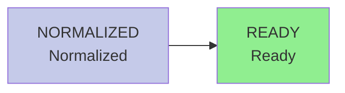

# PaperBase

<div align="center">

**Transform academic papers into structured knowledge assets**

[](https://opensource.org/licenses/MIT)
[](https://www.python.org/downloads/)
[](tests/)
[](https://github.com/astral-sh/ruff)
[](#security-improvements)

English | [中文文档](README.md)

</div>

---

## 📖 What is PaperBase?

PaperBase is an **academic paper knowledge base scaffold** designed for the AI era. It solves a critical limitation of traditional reference managers (Zotero, Mendeley): **the inability to transform papers into machine-understandable structured knowledge**.

When researchers need to extract key concepts from hundreds of papers, trace methodological evolution, or build domain knowledge graphs, existing tools only provide PDF files and metadata. PaperBase provides:

- 📝 **Canonical Markdown** with full semantic structure
- 🔗 **Rebuildable knowledge graph** projections (paper relationship networks)
- 🔄 **Idempotent processing pipeline** (interruptible, resumable, traceable)
- 🤖 **AI Agent friendly** (CLI + structured output)

---

## ⚡ 5-Minute Overview

**In One Sentence: Transform PDF papers into machine-understandable knowledge networks**

**Core Pipeline:**
```
PDF → Markdown → Knowledge Graph → Search/Analysis
```

**Difference from Zotero:**

| Tool | Purpose | Typical Scenario |
|------|---------|-----------------|
| **Zotero** | Reference Manager (manage PDFs + citations) | 📚 Reading papers, inserting citations into Word |
| **PaperBase** | Knowledge Base (extract structured knowledge) | 🔬 Graph visualization, semantic association, deep search |

**5-Second Decision:**
- ✅ If you only need "organize papers + generate bibliography" → **Use Zotero**
- ✅ If you need "extract method evolution from 100 papers" → **Use PaperBase**
- 💡 Both can be combined (PaperBase supports Zotero import)

**Key Concepts:**
- **Canonical Markdown**: Each paper corresponds to one `paper.md`, the single source of truth—all indexes, graphs, chunks can be rebuilt from it
- **Simplified State Machine**: Paper processing has only 2 main states (NORMALIZED after ingestion → READY after graph update), interruptible and resumable
- **Dual Search System**: SQLite FTS5 for keyword search ("find papers containing 'transformer'"), Graphify for relationship queries ("citation lineage of this paper")

## ✨ Key Features

| Feature | Description |
|---------|-------------|
| **Canonical Markdown as Source of Truth** | All derived data (graphs, indexes, chunks) can be rebuilt from normalized Markdown files |
| **Content-Addressed Storage** | PDFs stored by SHA256 hash, eliminating duplication |
| **Idempotent State Machine** | Paper processing (download → convert → normalize → graph) is interruptible and resumable |
| **Incremental Graph Updates** | Detect content changes via SHA256 comparison, update only modified papers |
| **Batch Ingestion Mode** | Delay graph updates until all papers are ingested (3-5x faster) |
| **Full-Text Search** | SQLite FTS5-powered search with Boolean operators |
| **Schema Validation** | Pydantic-based strict validation (timestamps, enums, SHA256, ranges) |
| **Tool Agnostic** | Works with AI agents and traditional scripts alike |

## 🚀 Quick Start

### Prerequisites

- Python 3.11+
- [uv](https://github.com/astral-sh/uv) (Python package manager)
- Git

### Installation

```bash
# Clone the repository
git clone https://github.com/Chi-hong22/PaperBase.git
cd PaperBase

# Install dependencies
uv sync

# Install global tools
uv tool install graphify           # Knowledge graph builder (required)
uv tool install zotero-mcp-server  # Zotero integration (optional)

# Verify installation
graphify --version
uv run paperbase --help
```

### Ingest Your First Paper

```bash
# Ingest a paper (using open-access arXiv paper as example)
uv run paperbase ingest "arxiv:1706.03762"
```

**Expected Output:**
```
[2024-07-07 15:30:01] Fetching paper metadata...
[2024-07-07 15:30:03] Downloading PDF (2.1 MB)...
[2024-07-07 15:30:08] Converting PDF to Markdown...
[2024-07-07 15:30:15] Normalizing structure...
[2024-07-07 15:30:16] ✓ Paper ingested successfully

Paper ID:    arxiv:1706.03762
Storage ID:  p_a7f3b2c1d4e5
State:       NORMALIZED
Title:       Attention Is All You Need
Location:    library/papers/p_a7f3b2c1d4e5/paper.md

Next steps:
  - View paper: cat library/papers/p_a7f3b2c1d4e5/paper.md
  - Search: uv run paperbase search "attention mechanism"
  - Build graph: uv run paperbase graph update
```

**Try More Operations:**

```bash
# Check paper status
uv run paperbase status "arxiv:1706.03762"

# Search content
uv run paperbase search "attention mechanism"

# Update knowledge graph
uv run paperbase graph update

# Remove paper (hard delete, needs confirmation)
uv run paperbase remove "arxiv:1706.03762"
```

Papers are stored as `library/papers/<storage_id>/paper.md` with structured frontmatter.

## 📂 Repository Structure

```
paperbase/
├── library/                   # Knowledge base
│   ├── sources/pdf/          # Content-addressed PDF storage (SHA256)
│   ├── papers/               # Normalized papers
│   │   └── p_<storage_id>/  # Single paper
│   │       ├── paper.md      # Canonical Markdown (source of truth)
│   │       ├── manifest.json # State and provenance
│   │       ├── chunks.jsonl  # Search chunks (derived)
│   │       └── references.jsonl # Structured citations (derived)
│   ├── collections/          # User collections
│   └── notes/                # User notes
├── registry/                 # SQLite query index (derived)
├── graph/                    # Graphify knowledge graph (derived)
├── src/paperbase/           # Python package
├── skills/paperbase/        # Global AI agent skill
└── tests/                    # Test suite
```

**Important**: Only `library/papers/*/paper.md` and `manifest.json` are source of truth—everything else is rebuildable.

## 🎯 Use Cases

| Use Case | Description |
|----------|-------------|
| **Personal Knowledge Base** | Build a searchable, graph-based academic library |
| **AI Agent Data Source** | Provide structured paper data for LLM applications |
| **Team Collaboration** | Git-based version control for literature management |
| **Domain Knowledge Graph** | Analyze citation networks and methodological evolution |

## 📋 Usage

### LLM Configuration (for Graphify)

PaperBase core functions (ingest, convert, SQLite FTS5 search) **do not require LLM**.

**Graphify knowledge graph is a required component of PaperBase**, and LLM configuration is used to pass environment variables to Graphify.

If you have already configured Graphify's LLM via system environment variables (e.g., `OPENAI_API_KEY`), you can skip this step.

#### **Configuration Steps (when needed)**

**1. Create environment variable file**
```bash
# Copy example config
cp .env.example .env

# Edit .env
nano .env
```

**2. Set environment variables**
```bash
# .env file content
PAPERBASE_LLM_BASE_URL="https://api.openai.com/v1"
PAPERBASE_LLM_API_KEY="sk-..."
PAPERBASE_LLM_MODEL="gpt-4o-mini"
```

**3. Verify Graphify works**
```bash
# PaperBase will pass config to graphify
uv run paperbase graph update
```

See [`.env.example`](.env.example) and [docs/guides/graphify-integration-guide.md](docs/guides/graphify-integration-guide.md) for details.

---

### External Tool Integration (Optional)

PaperBase supports external tool integration for extended capabilities:

#### 1. paper-fetch-skill (Online Paper Fetching)

For fetching structured metadata and full text via DOI, arXiv ID, or paper URL.

**Installation**:
```bash
# Visit the project repository and follow installation instructions
# https://github.com/Dictation354/paper-fetch-skill
```

After installation, `paperbase ingest` accepts online identifiers:
```bash
uv run paperbase ingest "10.1038/s41586-026-10265-5"
uv run paperbase ingest "arxiv:2301.07041"
```

Local PDFs don't need this tool:
```bash
uv run paperbase ingest --file paper.pdf
```

#### 2. Graphify (Knowledge Graph Construction, Required)

**Graphify is a required component** for PaperBase's knowledge graph functionality, used to build and query semantic knowledge graphs and citation networks.

**Installation**:
```bash
# Method 1: Global install via uv (recommended)
uv tool install graphify

# Method 2: Visit project repository for instructions
# https://github.com/Graphify-Labs/graphify
```

After installation, use graph features:
```bash
uv run paperbase graph update
```

Technical integration docs: [docs/guides/graphify-integration-guide.md](docs/guides/graphify-integration-guide.md)

#### 3. Zotero MCP (Planned Integration)

For integration with Zotero reference manager (coming soon).

**Project URL**: https://github.com/54yyyu/zotero-mcp

---

### Ingest Papers

```bash
# Via DOI
uv run paperbase ingest "10.1038/nature12373"

# Via arXiv
uv run paperbase ingest "arxiv:2301.07041"

# Local PDF
uv run paperbase ingest --file paper.pdf

# Batch ingestion (recommended for multiple papers)
# Unix/Linux/macOS:
cat > papers.txt << EOF
/path/to/paper1.pdf
/path/to/paper2.pdf
/path/to/paper3.pdf
EOF

uv run paperbase ingest --batch papers.txt

# Windows PowerShell:
@"
C:\path\to\paper1.pdf
C:\path\to\paper2.pdf
C:\path\to\paper3.pdf
"@ | Out-File -Encoding UTF8 papers.txt

uv run paperbase ingest --batch papers.txt

# Skip automatic graph update (for continuous ingestion)
uv run paperbase ingest paper.pdf --no-graph
```

### Search and Query

```bash
# View all papers
uv run paperbase status

# View papers by state
uv run paperbase status --state ready

# Full-text search
uv run paperbase search "transformer architecture" -n 20
```

### Knowledge Graph

```bash
# Update graph (process newly ingested papers)
uv run paperbase graph update

# Incremental update (only papers with content changes)
uv run paperbase graph update --incremental

# Force rebuild graph
uv run paperbase graph update --force

# View graph status
uv run paperbase graph status
```

## 🤖 AI Agent Integration

### Global Skill Installation

PaperBase provides a global skill for Claude Code and Codex:

```bash
# One-command setup
./skills/paperbase/install.sh

# Or manual installation
# For Claude Code / Codex:
cp -r skills/paperbase ~/.claude/skills/
```

After installation, invoke with `/paperbase` in any AI agent session:

```
/paperbase ingest "10.1038/nature12373"
/paperbase search "deep learning"
/paperbase status
```

See [skills/paperbase/README.md](skills/paperbase/README.md) for details.

## 🏗️ Architecture

### State Machine

Papers are processed through a simplified state machine (defined in `manifest.json`):



**Main Flow States:**

| State | Description | Triggered By |
|-------|-------------|--------------|
| ✨ NORMALIZED | Paper ingested and converted to Canonical Markdown | `paperbase ingest` |
| 🎉 READY | Added to knowledge graph, ready for semantic queries | `paperbase graph update` |

**Exception States:**

| State | Description |
|-------|-------------|
| ⚠️ NEEDS_REVIEW | Requires manual review (e.g., incomplete metadata) |
| ⏸️ BLOCKED | Processing blocked (e.g., encrypted PDF) |
| 🔄 FAILED_RETRYABLE | Temporary failure (e.g., network timeout), can retry |
| ❌ FAILED_PERMANENT | Permanent failure (e.g., DOI doesn't exist) |

**Design Philosophy**:
- **Canonical Markdown** is the single source of truth, all other data (registry, graph) can be rebuilt from it
- State machine simplified to 2 main states, reducing complexity
- See [AGENTS.md](AGENTS.md) for complete state transition rules

### Core Modules

- **`core/identity.py`**: paper_id normalization and storage_id generation
- **`core/paths.py`**: Path management (with safety validation)
- **`core/manifest.py`**: State machine and provenance management
- **`core/normalizer.py`**: Markdown normalizer
- **`core/registry.py`**: SQLite index (supports context manager)
- **`core/search_engine.py`**: Full-text search (FTS5)
- **`adapters/`**: External tool adapters (PDF extraction, conversion, Graphify)

### Retrieval Architecture: Why Both SQLite FTS5 and Knowledge Graph?

**Different purposes, complementary strengths**:

| Dimension | SQLite FTS5 (Full-Text Search) | Graphify (Knowledge Graph) |
|-----------|-------------------------------|---------------------------|
| **Search Target** | Find papers containing specific keywords | Discover relationships and paths between papers |
| **Query Type** | "Find all papers mentioning 'transformer'" | "Find 5 papers closest to this one by citation" |
| **Indexed Content** | Full text (title, abstract, body) | Relationships (citations, co-authors, topics) |
| **Query Complexity** | O(log N), inverted index | O(N), graph traversal |
| **Results** | Document list + matched snippets | Relationship network + path distances |
| **Typical Use** | Keyword search, Boolean queries, fuzzy matching | Literature review, citation analysis, concept tracing |

**Real-world examples**:

```bash
# FTS5: "Which papers discuss attention mechanisms?"
uv run paperbase search "attention mechanism"
# Returns: List of papers containing these words, ranked by relevance

# Graphify: "What's the research lineage related to the Transformer paper?"
uv run paperbase query related "doi:10.48550/arXiv.1706.03762" --depth 2
# Returns: Citation tree, co-citation network
```

**Why not use only graph?**
- Graphs excel at relationship queries but not full-text semantic matching
- Graph traversal is expensive (O(N)) vs FTS5's inverted index (O(log N))
- Graphs require structured relationships; FTS5 handles arbitrary text

**Why not use only FTS5?**
- FTS5 returns matching documents but can't discover implicit relationships
- Can't answer "shortest citation path between these papers"
- Can't support "domain landscape view" for literature reviews

**Conclusion**:
- **FTS5 = Fast Locating** ("Find")
- **Graphify = Relationship Discovery** ("Understand")
- **Combined = Complete Knowledge Base Capability**

### Design Decisions

**Why not use Zotero directly?**
- Zotero excels at reference management but isn't ideal for AI agents: difficult to graph, coarse search granularity, uncontrollable schema
- PaperBase complements Zotero: can import from Zotero via MCP, but stores as structured Markdown

**Why Markdown instead of JSON?**
- Markdown is friendly to both humans and AI, supports rich text and diagrams, easy version control
- JSON suits metadata (manifest.json), Markdown suits content (paper.md)

**Why separate PDF storage?**
- Content-addressed (SHA256) eliminates duplicate storage, same PDF can be referenced by multiple paper metadata
- Supports multi-source scenarios: same paper may have different versions from arXiv, journal, conference

---

## ❓ FAQ

### Q1: I already have Zotero, do I still need PaperBase?

**Depends on use case:**

| Need | Recommended Tool | Reason |
|------|-----------------|--------|
| Manage papers, insert citations into Word | Zotero | Core strength of reference managers |
| Read PDFs, make annotations | Zotero | Built-in PDF reader |
| **Extract method evolution from 100 papers** | **PaperBase** | Knowledge graph + structured data |
| **AI Agent paper analysis** | **PaperBase** | Markdown + Schema validation |
| **Build domain knowledge graph** | **PaperBase** | Graphify relationship queries |

**Best Practice**: Combine both
- Manage and read papers in Zotero
- Import to PaperBase via MCP for deep analysis

### Q2: Is Graphify required?

**Yes, it is required**. Graphify is the core component of PaperBase's knowledge graph functionality.

| Feature | Description |
|---------|-------------|
| Ingest papers | ✅ Doesn't need Graphify |
| Keyword search (FTS5) | ✅ Doesn't need Graphify |
| **Knowledge graph construction** | ❌ **Requires Graphify** |
| **Citation relationship queries** | ❌ **Requires Graphify** |
| **Semantic search** | ❌ **Requires Graphify** |

**LLM Configuration Flexibility**:
- Graphify itself requires an LLM to work
- You can choose any compatible LLM provider (OpenAI, Anthropic, local models, etc.)
- Configuration methods: via `config/paperbase.yaml` or system environment variables

**Installation**:
```bash
uv tool install graphify
```

**If you don't want to use knowledge graph features**:
PaperBase can still be used for paper ingestion, storage, and FTS5 keyword search, but you'll lose:
- Citation network visualization
- Semantic similar paper recommendations
- Domain knowledge graph construction

### Q3: Why use uv instead of pip?

**Advantages of uv:**
- ⚡ **Faster**: 10-100x dependency resolution speed
- 🔒 **More reliable**: Lock file mechanism (uv.lock) ensures environment consistency
- 📦 **Simpler**: Integrated virtual environment management, tool installation

**If you must use pip**:
```bash
# Create virtual environment
python -m venv .venv
source .venv/bin/activate  # Windows: .venv\Scripts\activate

# Install dependencies
pip install -e .
```

But uv is recommended for the best experience.

---

## 🧪 Development

### Run Tests

```bash
# Run all tests
uv run pytest

# Run specific test
uv run pytest tests/unit/test_identity.py -v

# View coverage
uv run pytest --cov=paperbase --cov-report=html
open htmlcov/index.html
```

### Code Style

```bash
# Check formatting
uv run ruff check src/

# Auto-fix
uv run ruff check --fix src/
```

## 📜 License

MIT License

## 🔗 Related Links

- [AGENTS.md](AGENTS.md) - Agent work guide (must read)
- [CLAUDE.md](CLAUDE.md) - Claude-specific guide
- [Graphify](https://github.com/Graphify-Labs/graphify) - Knowledge graph tool
- [Zotero MCP](https://github.com/54yyyu/zotero-mcp) - Zotero integration
- [paper-fetch-skill](https://github.com/Dictation354/paper-fetch-skill) - Online paper fetching

## 🙏 Acknowledgments

This project benefits from the following open-source tools and projects:

### Core Dependencies
- [markitdown](https://github.com/microsoft/markitdown) - Microsoft's Markdown conversion tool
- [PyMuPDF](https://pymupdf.readthedocs.io/) - PDF processing library
- [Pydantic](https://docs.pydantic.dev/) - Data validation and schema management

### External Tool Integration
- [uv](https://github.com/astral-sh/uv) - Fast Python package manager by Astral
- [paper-fetch-skill](https://github.com/Dictation354/paper-fetch-skill) - Online paper fetching and conversion
- [Graphify](https://github.com/Graphify-Labs/graphify) - Knowledge graph construction tool
- [Zotero](https://www.zotero.org/) - Reference management software
- [Zotero MCP Server](https://github.com/54yyyu/zotero-mcp) - Zotero MCP integration service

### Development Tools
- [Ruff](https://github.com/astral-sh/ruff) - Extremely fast Python linter and formatter
- [pytest](https://docs.pytest.org/) - Python testing framework

---

<div align="center">
Made with ❤️ by researchers, for researchers
</div>
