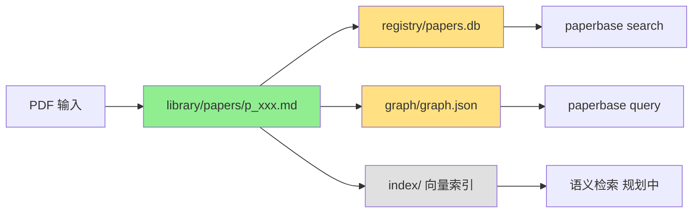

# 存储布局说明

## 概述

PaperBase 采用分层存储架构，核心理念：**Canonical Markdown 是唯一真相源，所有派生数据可重建**。

## 目录结构

```
<base_dir>/
├── library/                   # 知识库主体（真相源）
│   ├── sources/              # 去重的 PDF 缓存池
│   ├── papers/               # 规范化论文
│   ├── collections/          # 用户论文集合（规划中）
│   └── notes/                # 用户笔记（规划中）
├── registry/                 # SQLite 查询索引（派生）
├── graph/                    # Graphify 知识图谱（派生）
├── index/                    # 向量索引和嵌入缓存（派生）
└── config/                   # 配置文件
```

## 详细说明

### library/ - 知识库主体

#### library/sources/pdf/

**用途**: 去重的 PDF 缓存池

**结构**:
```
sources/
└── pdf/
    └── <sha256>.pdf  # 按 SHA256 哈希存储的 PDF 文件
```

**说明**:
- 同一 PDF 文件（通过 SHA256 识别）只存储一次
- 多篇论文可通过 `manifest.json` 中的 `source_artifacts` 引用同一 PDF
- 删除论文时，会检查 PDF 是否被其他论文引用，孤立 PDF 才会被删除

**示例**:
```bash
# 两篇论文引用同一 PDF
sources/pdf/a3f5e8c7...def2.pdf  # 被 p_164622e0fc87 和 p_36686d68e8e8 引用
```

#### library/papers/

**用途**: 存储规范化论文及其元数据

**结构**:
```
papers/
├── p_<storage_id>.md        # Canonical Markdown（真相源）
└── p_<storage_id>/         # 单篇论文数据目录
    ├── manifest.json       # 状态和溯源信息
    ├── chunks.jsonl        # 检索分块（可选派生）
    ├── references.jsonl    # 结构化引用（可选派生）
    ├── assets/             # 论文资源（可选）
    │   └── figure-*.png    # 图片等资源文件
    └── source/
        └── source.pdf      # 原始 PDF 文件（可选）
```

**核心文件**:

1. **`p_<storage_id>.md`** - Canonical Markdown（真相源）
   - 唯一真相源（source of truth）
   - 包含结构化 frontmatter（论文元数据）
   - 包含论文全文内容
   - 所有派生数据（registry、graph、chunks）均可从它重建

2. **`manifest.json`** - 状态和溯源信息
   - 记录论文处理状态（NORMALIZED、READY 等）
   - 记录来源（DOI、arXiv、本地文件等）
   - 记录处理历史和错误日志
   - Schema 定义: `src/paperbase/schemas/manifest.py`

**示例**:
```bash
# 示例论文结构
library/papers/
├── p_164622e0fc87.md               # Canonical Markdown
└── p_164622e0fc87/
    ├── manifest.json               # 状态: READY
    ├── references.jsonl            # 结构化引用
    ├── assets/
    │   ├── figure-001.png
    │   └── figure-002.png
    └── source/
        └── source.pdf
```

### registry/ - SQLite 查询索引（派生）

**用途**: 提供快速的全文检索和元数据查询

**结构**:
```
registry/
└── papers.db  # SQLite 数据库文件
```

**功能**:
- 基于 SQLite FTS5 的全文检索索引
- 存储论文元数据（标题、作者、年份等）
- 支持布尔运算符、模糊匹配

**使用命令**:
```bash
# 全文搜索
paperbase search "transformer architecture"

# 查看所有论文
paperbase status

# 重建索引
paperbase index
```

**重建方式**:
```bash
# 删除并重建
rm registry/papers.db
paperbase status  # 自动重建索引
```

### graph/ - Graphify 知识图谱（派生）

**用途**: 存储论文语义关联网络

**结构**:
```
graph/
└── graph.json  # 知识图谱文件
```

**功能**:
- 存储论文间的语义关联（节点 + 边）
- 支持引用关系查询
- 支持语义相似度查询
- 支持路径发现

**生成方式**:
```bash
# 更新知识图谱
paperbase graph update

# 增量更新（仅更新内容变化的论文）
paperbase graph update --incremental

# 强制重建
paperbase graph update --force
```

**依赖关系**:
- **必需**: `paperbase query` 命令（引用关系查询、相似论文推荐）
- **不需要**: `paperbase search` 命令（基于 SQLite FTS5）

**文件结构示例**:

```json
{
  "nodes": [
    {
      "id": "p_164622e0fc87",
      "type": "paper",
      "properties": {
        "title": "Attention Is All You Need",
        "authors": ["Vaswani et al."],
        "year": 2017
      }
    },
    {
      "id": "p_36686d68e8e8",
      "type": "paper",
      "properties": {
        "title": "BERT: Pre-training of Deep Bidirectional Transformers",
        "authors": ["Devlin et al."],
        "year": 2018
      }
    }
  ],
  "edges": [
    {
      "source": "p_36686d68e8e8",
      "target": "p_164622e0fc87",
      "type": "cites",
      "properties": {}
    }
  ]
}
```

**与 registry/papers.db 的区别**:

| 维度           | registry/papers.db (SQLite FTS5) | graph/graph.json (Graphify)     |
|----------------|----------------------------------|----------------------------------|
| **检索目标**   | 查找包含特定关键词的论文          | 发现论文之间的关系和路径          |
| **查询类型**   | "找到所有提到 'transformer' 的论文" | "找到与这篇论文引用关系最近的 5 篇" |
| **索引内容**   | 论文全文（标题、摘要、正文）      | 论文间关系（引用、共同作者、主题） |
| **查询复杂度** | O(log N)，基于倒排索引            | O(N)，图遍历算法                 |
| **返回结果**   | 文档列表 + 匹配片段               | 关系网络 + 路径距离              |
| **典型场景**   | 关键词搜索、布尔查询、模糊匹配    | 文献综述、引用分析、概念追溯      |

**调试建议**:
```bash
# 查看图谱状态
paperbase graph status

# 检查 graph.json 是否存在
ls -lh graph/graph.json

# 如果图谱损坏或不完整，强制重建
paperbase graph update --force
```

### index/ - 向量索引和嵌入缓存（派生）

**用途**: 存储向量嵌入和检索索引（规划中）

**结构**:
```
index/
├── embeddings/  # 向量嵌入缓存
└── faiss/       # FAISS 索引文件
```

**状态**: 规划中，暂未实现

### config/ - 配置文件

**用途**: 存储项目配置

**结构**:
```
config/
└── paperbase.yaml  # 主配置文件
```

**配置内容**:
- LLM 配置（API 端点、模型）
- 知识图谱更新策略
- 路径配置
- Adapter 配置

## 数据流向



**说明**:
- 绿色: 真相源（source of truth）
- 黄色: 派生数据（可重建）
- 灰色: 规划中

## 重建派生数据

### 重建 registry/papers.db

```bash
# 方法 1: 使用 sync 命令清理孤立记录
paperbase sync

# 方法 2: 完全重建
rm registry/papers.db
paperbase status  # 自动重建索引
```

### 重建 graph/graph.json

```bash
# 增量更新（推荐）
paperbase graph update --incremental

# 强制重建
paperbase graph update --force
```

### 重建 chunks.jsonl 和 references.jsonl

```bash
# 这些文件由论文处理流程自动生成
# 如果丢失，重新摄入论文即可重建
paperbase ingest --file paper.pdf
```

## 存储空间估算

| 目录                       | 典型大小（100 篇论文） | 可重建 |
|----------------------------|------------------------|--------|
| library/sources/pdf/       | ~500 MB                | ❌     |
| library/papers/*.md        | ~50 MB                 | ❌     |
| library/papers/*/assets/   | ~100 MB                | ❌     |
| registry/papers.db         | ~5 MB                  | ✅     |
| graph/graph.json           | ~2 MB                  | ✅     |
| **总计**                   | **~657 MB**            | -      |

**备份建议**:
- 必须备份: `library/` 目录（真相源）
- 可选备份: `config/` 目录（配置文件）
- 无需备份: `registry/`、`graph/`、`index/`（可重建）

## 相关文档

- [AGENTS.md](../../AGENTS.md) - Agent 工作指南
- [docs/schemas/validation-rules.md](../schemas/validation-rules.md) - Schema 验证规则
- [docs/graph-update-strategy.md](../graph-update-strategy.md) - 知识图谱更新策略
- [docs/guides/graphify-integration-guide.md](../guides/graphify-integration-guide.md) - Graphify 集成指南
