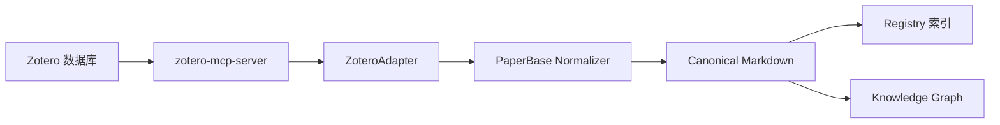

# Zotero 集成指南

## 概述

PaperBase 通过 `zotero-mcp-server` 集成 Zotero 文献管理器。单篇或最近条目导入时，本地模式会优先读取 Zotero 元数据；若条目存在可访问的本地 PDF 附件，则继续走完整 PDF 摄入流程生成 Canonical 全文。

**定位**: 互补工具，而非替代关系

| 工具          | 核心优势                     | 适用场景                     |
| --------------- | ------------------------------ | ------------------------------ |
| **Zotero**    | 文献管理、PDF 阅读、引文插入 | 日常阅读、文献整理、写作引用 |
| **PaperBase** | 知识图谱、结构化检索、AI 分析 | 文献综述、领域分析、概念追溯 |

**最佳实践**: 在 Zotero 中管理论文，通过集成导入到 PaperBase 进行深度分析。

---

## 前提条件

### 必需

1. **安装 zotero-mcp-server**

   ```bash
   uv tool install zotero-mcp-server
   ```

2. **验证安装**

   ```bash
   # 检查是否安装成功
   uv run python -c "import importlib.metadata as m; print(m.version('zotero-mcp-server'))"
   # 当前已验证版本: 0.6.1
   ```

### 可选（取决于使用模式）

- **本地模式**: 需要 Zotero 应用程序在本机运行
- **Web API 模式**: 需要 Zotero API Key 和 Library ID

---

## 两种配置模式

### 模式 1: 本地模式（推荐）

**优势**: 配置简单，无需 API Key

**前提条件**: Zotero 应用程序在本机运行

#### 配置步骤

1. **启用 Zotero HTTP 服务器**

   打开 Zotero → 编辑 → 首选项 → 高级 → 常规：
   - ✓ 启用 HTTP 服务器
   - 默认端口: 23119

2. **启动 Zotero**

   确保 Zotero 应用程序正在运行（最小化到系统托盘也可）

3. **配置 PaperBase**

   编辑 `config/paperbase.yaml`：

   ```yaml
   adapters:
     zotero:
       enabled: true
       local_mode: true  # 默认值
   ```

4. **验证连接**

   ```bash
   # 测试导入（不会实际导入，仅验证连接）
   uv run paperbase ingest --zotero-key TEST123
   ```

   **预期结果**:
   - ✓ 成功: 显示 "Failed to fetch item TEST123: ..." (item 不存在，但连接成功)
   - ✗ 失败: 显示 "Zotero 初始化失败: ... WinError 10061" (Zotero 未运行)

---

### 模式 2: Web API 模式

**优势**: 无需本地 Zotero，可在服务器环境使用

**前提条件**: 拥有 Zotero 账号和 API 访问权限

#### 配置步骤

1. **获取 API Key**

   访问 [https://www.zotero.org/settings/keys](https://www.zotero.org/settings/keys)：
   - 点击 "Create new private key"
   - 权限设置: 勾选 "Allow library access"
   - 复制生成的 API Key (形如 `Ab12Cd34Ef56Gh78`)

2. **获取 Library ID**

   访问 [https://www.zotero.org/settings/keys](https://www.zotero.org/settings/keys)：
   - 在页面顶部找到 "Your userID for use in API calls"
   - 复制数字 ID (形如 `1234567`)

3. **配置 PaperBase**

   **方式 A: 通过环境变量（推荐）**

   ```bash
   # Linux/macOS
   export ZOTERO_API_KEY="Ab12Cd34Ef56Gh78"
   export ZOTERO_LIBRARY_ID="1234567"
   export ZOTERO_LIBRARY_TYPE="user"  # 或 "group"

   # Windows PowerShell
   $env:ZOTERO_API_KEY = "Ab12Cd34Ef56Gh78"
   $env:ZOTERO_LIBRARY_ID = "1234567"
   $env:ZOTERO_LIBRARY_TYPE = "user"
   ```

   **方式 B: 通过配置文件**

   编辑 `config/paperbase.yaml`：

   ```yaml
   adapters:
     zotero:
       enabled: true
       local_mode: false
       api_key: ${ZOTERO_API_KEY}
       library_id: ${ZOTERO_LIBRARY_ID}
       library_type: user  # 或 group
   ```

   然后设置环境变量（避免明文存储 API Key）：

   ```bash
   export ZOTERO_API_KEY="Ab12Cd34Ef56Gh78"
   export ZOTERO_LIBRARY_ID="1234567"
   ```

4. **验证配置**

   ```bash
   uv run paperbase doctor
   ```

   检查 "Zotero Configuration" 部分是否显示 API Key 和 Library ID。

---

## 使用方式

### 1. 单篇论文导入

```bash
# 基本用法
uv run paperbase ingest --zotero-key <ITEM_KEY>
```

**获取 Item Key**:
1. 在 Zotero 中右键点击论文
2. 选择 "复制链接" 或 "Show Item in Library"
3. URL 中最后 8 位字符即为 Item Key (如 `ABC12DEF`)

**示例**:

```bash
# 导入指定论文
uv run paperbase ingest --zotero-key ABC12DEF
```

**预期输出**:

```
[cyan]从 Zotero 导入论文:[/cyan] ABC12DEF

[yellow]1. 获取 Zotero 条目...[/yellow]
   标题: Attention Is All You Need
   作者: Vaswani, A., Shazeer, N., Parmar, N.
   年份: 2017
   类型: journalArticle
   PDF: 有

[yellow]2. 生成 paper_id...[/yellow]
   paper_id: arxiv:1706.03762
   storage_id: p_abc123...

[yellow]3. 检查是否已存在...[/yellow]
   ✓ 论文不存在，可以导入

[yellow]4. 创建论文结构...[/yellow]
   ✓ 论文元数据已保存

[yellow]5. 更新全文检索索引...[/yellow]
   ✓ 索引更新完成

[yellow]6. 更新知识图谱...[/yellow]
   ✓ 知识图谱更新完成

[green]✓ 摄入完成[/green]
   论文已成功添加到知识库
```

---

### 2. 批量导入最近论文

```bash
# 导入最近添加的 N 篇论文
uv run paperbase ingest --zotero-recent <N>
```

**示例**:

```bash
# 导入最近 10 篇论文
uv run paperbase ingest --zotero-recent 10

# 批量导入且跳过索引更新（速度更快）
uv run paperbase ingest --zotero-recent 50 --no-graph
```

**预期输出**:

```
[cyan]从 Zotero 批量导入最近 10 篇论文[/cyan]

[yellow]获取 Zotero 条目列表...[/yellow]
✓ 获取到 10 篇论文

[1/10] Attention Is All You Need (2017)
   ✓ 导入成功

[2/10] BERT: Pre-training of Deep Bidirectional Transforme... (2018)
   ⊘ 已存在，跳过

[3/10] GPT-3: Language Models are Few-Shot Learners (2020)
   ✓ 导入成功

...

[green]✓ 批量导入完成[/green]
   成功: 7 篇
   跳过: 2 篇（已存在）
   失败: 1 篇

[yellow]更新全文检索索引...[/yellow]
   ✓ 索引更新完成

[yellow]更新知识图谱...[/yellow]
   ✓ 知识图谱更新完成
```

---

## 工作流程

### 数据流



### 处理步骤

1. **获取元数据**: 从 Zotero 读取论文信息（标题、作者、年份、DOI、摘要等）
2. **生成 paper_id**: 优先使用 DOI，其次 arXiv ID，最后回退到 Zotero Key
3. **查重检查**: 检查 DOI 和标题是否已存在，避免重复导入
4. **规范化**: 转换为 PaperBase Canonical Markdown 格式
5. **注册**: 添加到 Registry 索引（支持全文检索）
6. **图谱化**: 加入知识图谱（支持关系查询）

---

## 查重机制

PaperBase 自动检测重复论文，避免多次导入：

### 查重规则

1. **DOI 查重**（优先）
   - 如果论文有 DOI，检查是否已存在相同 DOI 的论文
   - DOI 大小写不敏感（`10.1038/nature` = `10.1038/NATURE`）

2. **标题查重**（备用）
   - 如果无 DOI，使用标题查重
   - 标题归一化：移除标点、统一大小写、移除多余空格
   - 示例: `"Attention Is All You Need?"` → `"attention is all you need"`

### 查重行为

```bash
# 首次导入
uv run paperbase ingest --zotero-key ABC12DEF
# 输出: ✓ 导入成功

# 再次导入同一论文
uv run paperbase ingest --zotero-key ABC12DEF
# 输出: ⊘ 论文已存在（通过 DOI 匹配），跳过
```

**批量导入时**: 跳过已存在的论文，继续处理其他论文

---

## 数据映射表

### Zotero → PaperBase 字段映射

| Zotero 字段  | PaperBase 字段       | 说明                               |
| -------------- | ---------------------- | ------------------------------------ |
| `key`        | `source_artifact`    | Zotero Item Key (8 位字符)         |
| `title`      | `title`              | 论文标题                           |
| `creators`   | `authors`            | 作者列表（逗号分隔 → 列表）        |
| `date`       | `year`               | 发表年份（从日期提取）             |
| `DOI`        | `doi` + `paper_id`   | DOI 作为唯一标识符                 |
| `abstractNote` | `abstract`           | 摘要                               |
| `itemType`   | `metadata.item_type` | 文献类型（journalArticle, book 等） |
| `url`        | `url`                | 论文 URL                           |

### 年份解析规则

支持多种日期格式：

| Zotero Date 字段 | 提取结果 | 说明                     |
| ------------------ | ---------- | -------------------------- |
| `2023-01-15`     | `2023`   | ISO 格式                 |
| `2020/12/31`     | `2020`   | 斜线分隔                 |
| `2019`           | `2019`   | 仅年份                   |
| `January 2021`   | `2021`   | 月份 + 年份              |
| 空或无效         | `2026`   | 回退到当前年份           |
| `9999`           | `2026`   | 拒绝占位符，回退当前年份 |

---

## 功能限制

### 当前边界

1. **PDF 附件读取仅限本地模式**

   Web API 模式无法访问本机文件路径，因此只导入 Zotero 元数据。若本地模式未找到附件、附件路径失效或 PDF 转换失败，论文可能保持 metadata-only/abstract-only，并在建图预检中进入 `NEEDS_REVIEW`。

2. **集合过滤**

   当前 `--zotero-recent` 导入所有最近论文，无法指定特定集合（Collection）。

3. **标签和注释**

   Zotero 中的标签（Tags）和笔记（Notes）不会导入。

4. **附件可访问性**

   PaperBase 只处理 `zotero-mcp-server` 返回且本机可访问的 PDF 路径；云端未下载、链接附件或非 PDF 附件不会被当作完整全文导入。

---

## 常见问题

### Q1: 为什么导入的论文没有全文？

**A**: 本地模式只有在 Zotero 条目存在可访问的 PDF 附件时才会导入全文。Web API 模式、云端未下载附件或无 PDF 的条目只会生成元数据/摘要级 Canonical。

**推荐做法**:
1. 使用 PDF 导入获取完整内容：
   ```bash
   uv run paperbase ingest --file paper.pdf
   ```
2. 或先让 Zotero 下载附件，再重新执行该条目的导入/修复流程

**对比**:

| 导入方式         | 元数据 | 全文 | 图表 | 公式 | 知识图谱质量 |
| ------------------ | -------- | ------ | ------ | ------ | -------------- |
| `--zotero-key`（本地附件可用） | ✓ | ✓ | ✓ | ✓ | 高（完整内容） |
| `--zotero-key`（无本地附件） | ✓ | ✗ | ✗ | ✗ | 低（仅元数据/摘要） |
| `--file paper.pdf` | ✓      | ✓    | ✓    | ✓    | 高（完整内容） |

---

### Q2: 本地模式连接失败怎么办？

**错误信息**: `Zotero 初始化失败: ... WinError 10061` 或 `Connection refused`

**原因**: Zotero 应用程序未运行或 HTTP 服务器未启用

**解决步骤**:
1. **启动 Zotero 应用程序**
2. **检查 HTTP 服务器设置**:
   - 打开 Zotero → 编辑 → 首选项 → 高级 → 常规
   - 确认 "启用 HTTP 服务器" 已勾选
   - 默认端口: 23119
3. **验证连接**:
   ```bash
   # Windows PowerShell
   Test-NetConnection -ComputerName localhost -Port 23119

   # Linux/macOS
   nc -zv localhost 23119
   ```
4. **重试导入**:
   ```bash
   uv run paperbase ingest --zotero-key ABC12DEF
   ```

---

### Q3: Web API 模式如何配置？

**A**: 参考上文 "模式 2: Web API 模式" 配置步骤。

**关键点**:
- 需要 API Key 和 Library ID
- 推荐通过环境变量配置（避免明文存储）
- Library Type 选择 `user`（个人文库）或 `group`（群组文库）

**验证配置**:
```bash
uv run paperbase doctor
```

检查输出中的 "Zotero Configuration" 部分。

---

### Q4: 批量导入时部分论文失败？

**A**: 批量导入会跳过失败的论文，继续处理其他论文。

**常见失败原因**:
1. **论文已存在**: 跳过（计入 `skip_count`）
2. **缺少必需字段**: 如标题为空（计入 `failed_count`）
3. **Zotero 数据错误**: 如日期格式异常（计入 `failed_count`）

**诊断方法**:
```bash
# 查看详细错误信息（使用单篇导入测试）
uv run paperbase ingest --zotero-key <FAILED_KEY>
```

---

### Q5: 如何找到 Zotero Item Key？

**方法 1: 通过 Zotero 界面**
1. 在 Zotero 中右键点击论文
2. 选择 "Show Item in Library"
3. 查看地址栏 URL: `zotero://select/library/items/<ITEM_KEY>`
4. 最后 8 位字符即为 Item Key (如 `ABC12DEF`)

**方法 2: 通过 Zotero URI**
1. 右键点击论文 → "复制链接"
2. 粘贴得到类似 `http://zotero.org/users/1234567/items/ABC12DEF`
3. 最后 8 位字符即为 Item Key

**方法 3: 批量查看**
```bash
# 列出最近论文的 Key（需要实现辅助命令）
# 当前版本暂不支持，建议使用 --zotero-recent 批量导入
```

---

### Q6: 导入后如何验证？

```bash
# 方式 1: 查看论文状态
uv run paperbase status "doi:10.1038/nature"

# 方式 2: 搜索论文
uv run paperbase search "attention mechanism"

# 方式 3: 检查文件系统
ls library/papers/p_*.md
cat library/papers/p_<storage_id>.md
```

---

### Q7: 已存在的论文如何更新？

**A**: 当前版本不支持就地更新，需要删除后重新导入。

```bash
# 1. 删除旧记录
uv run paperbase remove "doi:10.1038/nature"

# 2. 重新导入
uv run paperbase ingest --zotero-key ABC12DEF
```

**注意**: 删除操作会清理所有相关数据（Markdown、索引、图谱），不可恢复。

---

## 故障排查

### 诊断命令

```bash
# 1. 检查环境
uv run paperbase doctor

# 2. 检查 zotero-mcp-server 安装
python -c "import zotero_mcp; print(zotero_mcp.__version__)"

# 3. 检查配置文件
cat config/paperbase.yaml | grep -A 5 "zotero:"

# 4. 测试 Zotero 连接（本地模式）
# Windows PowerShell
Test-NetConnection -ComputerName localhost -Port 23119

# Linux/macOS
nc -zv localhost 23119
```

---

### 常见错误及解决方案

| 错误信息                                            | 可能原因                | 解决方案                               |
| ----------------------------------------------------- | ------------------------- | ---------------------------------------- |
| `zotero-mcp-server is not installed`                | 未安装依赖              | `uv tool install zotero-mcp-server`    |
| `WinError 10061` / `Connection refused`             | Zotero 未运行           | 启动 Zotero 应用程序                   |
| `Failed to fetch item <KEY>: ...`                   | Item Key 不存在         | 检查 Key 是否正确                      |
| `api_key and library_id are required`               | Web API 配置缺失        | 设置环境变量或配置文件                 |
| `Failed to parse Zotero item: missing key or title` | Zotero 数据不完整       | 在 Zotero 中补充必需字段后重试         |
| `论文已存在（通过 DOI 匹配），跳过`                | 重复导入                | 正常行为，跳过已存在的论文             |
| `Zotero error: ...`                                 | zotero-mcp-server 内部错误 | 查看详细错误信息，可能需要更新版本     |

---

## 性能优化

### 批量导入最佳实践

```bash
# 1. 大批量导入时跳过索引更新（加速 3-5 倍）
uv run paperbase ingest --zotero-recent 100 --no-graph

# 2. 完成后统一更新索引
uv run paperbase index
uv run paperbase graph update

# 3. 如果中途中断，使用增量更新
uv run paperbase graph update --incremental
```

### 查重性能

- **DOI 查重**: O(1) - 基于 B-tree 索引，极快
- **标题查重**: O(N) - 需要扫描所有论文，较慢

**建议**: 尽量确保 Zotero 中的论文有 DOI，避免标题查重。

---

## 与其他功能的集成

### 搜索导入的论文

```bash
# 全文搜索
uv run paperbase search "attention mechanism"

# 按年份过滤
uv run paperbase search "transformer" --year-min 2020

# 按状态过滤
uv run paperbase search "deep learning" --state ready
```

### 知识图谱分析

```bash
# 查看相关论文
uv run paperbase query related "doi:10.48550/arXiv.1706.03762"

# 通过共享概念和引用查找相关论文
uv run paperbase query related "arxiv:1706.03762" --depth 2
```

### 批量管理

```bash
# 查看所有论文
uv run paperbase status

# 按状态过滤
uv run paperbase status --state normalized

# 同步索引
uv run paperbase sync
```

---

## 相关文档

- [README.md](../../README.md#外部工具集成) - 外部工具集成概述
- [docs/usage/search.md](../usage/search.md) - 搜索命令使用指南
- [docs/troubleshooting/online-fetch-limitations.md](../troubleshooting/online-fetch-limitations.md) - 在线获取论文的局限性
- [CLAUDE.md](../../CLAUDE.md#外部工具依赖) - Claude 特定指南

---

## 未来计划

- [ ] PDF 附件导入支持
- [ ] 集合（Collection）过滤
- [ ] 标签（Tags）导入
- [ ] 笔记（Notes）同步
- [ ] 双向同步（PaperBase → Zotero）
- [ ] 交互式选择界面

---

## FAQ 快速索引

- [为什么导入的论文没有全文？](#q1-为什么导入的论文没有全文)
- [本地模式连接失败怎么办？](#q2-本地模式连接失败怎么办)
- [Web API 模式如何配置？](#q3-web-api-模式如何配置)
- [批量导入时部分论文失败？](#q4-批量导入时部分论文失败)
- [如何找到 Zotero Item Key？](#q5-如何找到-zotero-item-key)
- [导入后如何验证？](#q6-导入后如何验证)
- [已存在的论文如何更新？](#q7-已存在的论文如何更新)

---

Made with ❤️ for researchers
